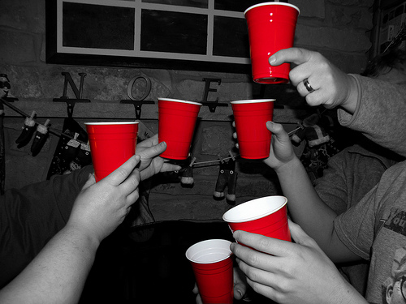
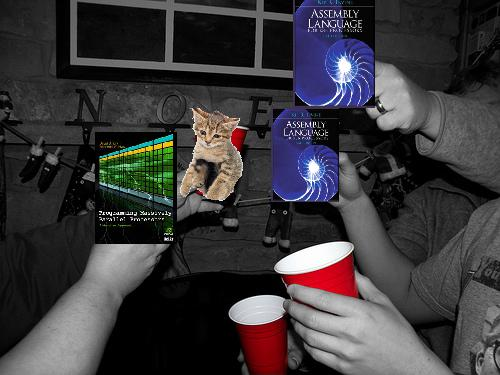
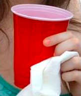
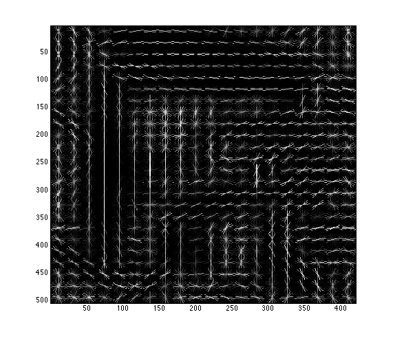
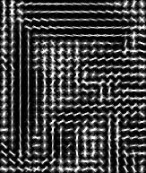

#Beer to Cats#

##Installation##
1. Ensure that you have python 2.7.5+
2. Install [pip](http://www.pip-installer.org/en/latest/installing.html)
    - On Ubuntu: `sudo apt-get install python-pip`
    - On Windows, OS X, or Ubuntu: 
        1. First, download [get-pip.py](https://raw.github.com/pypa/pip/master/contrib/get-pip.py) `$ curl https://raw.github.com/pypa/pip/master/contrib/get-pip.py`
        2. Then run `$ python get-pip.py`
3. `$ pip install -r requirements.txt` (may require `sudo`)

###Installation Errors?###

We did not experience any issues installing natively. We did experience issues installing PIL on 

##Usage##
There are two primary ways to use the project:

1. Run the program via the command line and input images as command line parameters.
    ```
    $ python beer_to_cats.py <image.{png,jpg,jpeg,gif}>
    ```

2. Run the program on the webapp we've created. You can do that ~~either by navigating to [BeerToCats.com](http://www.BeerToCats.com)~~ (Edit: we've been having issues with pip and Heroku, so we're currently moving to an EC2 instance) by executing the following commands:
    ```
    $ python yolocups.py
     * Running on http://127.0.0.1:5000/
     * Restarting with reloader
    ```
Then navigate to http://127.0.0.1:5000/ and follow the instructions on the website as you would otherwise.

##Demo##
####Input:####


####Output:####


####Input:####



####Output:####



##Theory##
Let's say we have the following image where we want to find all of the solo cups and cover them with a cat. We will refer to this image in the following paragraphs.


There are several widely-used methods for feature detection – e.g. [Haar-like Feature Detection](https://www.cs.cmu.edu/~efros/courses/LBMV07/Papers/viola-cvpr-01.pdf), [Histogram-of-Oriented Gradient (HOG) Feature Detection](http://lear.inrialpes.fr/people/triggs/pubs/Dalal-cvpr05.pdf), etc.

For this project, we chose HOG detection. Therefore, we also needed to use a [Support Vector Machine (SVM)](http://en.wikipedia.org/wiki/Support_vector_machine) as the classifier.

To get the best results, we need a training set. We peroused the web for images of cans, bottles, and solo cups. Then, since this involves supervised learning, we went through drawing boxes around all of the cans, bottles, and cups. Using the previous image, we end up with the following:


Once we have a good set of these, we generate an XML file of these images with the box annotations. From this, we then compute the HOG representation of the boxed images. We'll choose the most prominant solo cup for this example.

Before HOG:



How the computer sees it:


After computing the HOG of the image:

- Overlayed HOG Representation (computed using Mathematica)


- Pure HOG Representation (computed using Matlab)



- Another Pure HOG Representation (using [MIT's HOGgles](http://web.mit.edu/vondrick/ihog/))




These are fed into the SVM, with all of the possible orientations replicated and fed into the SVM as well.

###OK, so What is Histogram of Oriented Gradient (HOG)?###

###What's a Support Vector Machine (SVM)?###


###Future Improvements###
- Train with more images
- Compare with Haar-like feature detection
- Use neural nets for a deeper learning

##TODO##
For program:
- **Known Issue**: program only works currently on jpgs and NOT pngs.

For documentation:
- Edit `README.md`: ensure instructions actually work... ugh I hate instructions that don't work.
